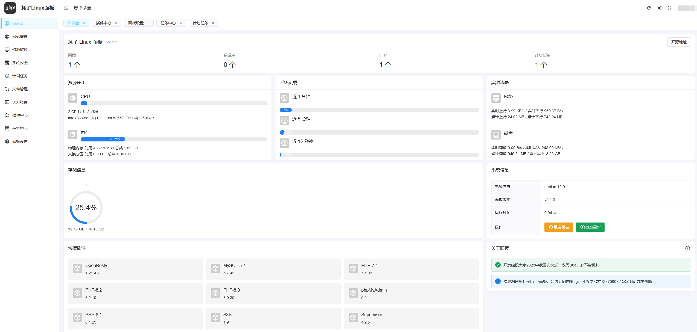

<p align="right">
[简体中文] | [<a href="README_EN.md">English</a>]
</p>

<h1 align="center" style="font-size: 40px">耗子面板</h1>

<p align="center">
  <a href="https://trendshift.io/repositories/10950" target="_blank"></a>
</p>

<p align="center">
  <a href="https://github.com/TheTNB/panel/releases"></a>
  <a href="https://github.com/TheTNB/panel/actions"></a>
  <a href="https://goreportcard.com/report/github.com/TheTNB/panel"></a>
  <a href="https://img.shields.io/github/license/TheTNB/panel"></a>
  <a href="https://app.fossa.com/projects/git%2Bgithub.com%2FTheTNB%2Fpanel?ref=badge_shield"></a>
</p>

耗子面板是使用 Golang + Vue 开发的开源轻量 Linux 服务器运维管理面板。

交流QQ群：[12370907](https://jq.qq.com/?_wv=1027&k=I1oJKSTH) | 论坛：[tom.moe](https://tom.moe) | 赞助：[爱发电](https://afdian.com/a/TheTNB)

## 优势

1. **极低占用:** 在 Debian 12 下部署面板 + LNMP 环境，内存占用不到 500 MB，遥遥领先于使用容器化的其他面板。
2. **低破坏性:** 面板的设计理念是尽可能减少对系统的额外修改，在同类面板中，我们对系统的修改最少。
3. **追随时代:** 面板所有组件均走在时代前沿，更新快，功能强大，安全性有保障。
4. **高效运维:** 面板 UI 界面简洁，操作简单，无需繁琐的配置，即可快速部署各类环境、调整应用设置。
5. **离线运行:** 面板运行可不依赖任何外部服务，你甚至可以在部署完成后停止面板进程，不会对已部署服务造成任何影响。
6. **久经考验:** 我们生产环境自 2022 年即开始使用，已稳定运行 1 年以上无事故。
7. **开源开放:** 面板开源，你可以自由修改、审计面板源码，安全性有保障。

## UI 截图



## 运行环境

耗子面板仅支持 `amd64` | `arm64` 架构下的主流系统的最新版本，不支持 `Ubuntu`，因为其发版太过频繁，难以维护。

低配机器建议使用 `Debian`，资源占用较 `RHEL` 系更低。其他机器建议使用 `AlmaLinux` | `RockyLinux`，维护周期更长也更稳定。

不在下表中的其他 RHEL 9.x 系统，可自行尝试安装，但不保证能够正常运行，且不提供技术支持（理论上不会有大问题）。

| 系统         | 版本 |
|------------|----|
| RHEL       | 9  |
| AlmaLinux  | 9  |
| RockyLinux | 9  |
| Debian     | 12 |

随着系统版本的不断更新，我们亦可能会终止部分过于老旧的系统的支持，以保证面板的稳定性。

## 安装面板

> **Warning**
> 安装面板前，你需要了解 LNMP 环境的基本知识，以及如何处理常见的 LNMP 环境问题，不建议 0 基础的用户安装和使用耗子面板。

如果你决定继续，请以`root`用户登录服务器，执行以下命令安装面板：

```shell
HAOZI_DL_URL="https://dl.cdn.haozi.net/panel"; curl -sSL -O ${HAOZI_DL_URL}/install_panel.sh && curl -sSL -O ${HAOZI_DL_URL}/install_panel.sh.checksum.txt && sha256sum -c install_panel.sh.checksum.txt && bash install_panel.sh || echo "Checksum 验证失败，文件可能被篡改，已终止操作"
```

## 卸载面板

优先建议备份数据重装系统，这样可以保证系统纯净。

如果你无法重装系统，请以`root`用户登录服务器，执行以下命令卸载面板：

```shell
HAOZI_DL_URL="https://dl.cdn.haozi.net/panel"; curl -sSL -O ${HAOZI_DL_URL}/uninstall_panel.sh && curl -sSL -O ${HAOZI_DL_URL}/uninstall_panel.sh.checksum.txt && sha256sum -c uninstall_panel.sh.checksum.txt && bash uninstall_panel.sh || echo "Checksum 验证失败，文件可能被篡改，已终止操作"
```

卸载面板前请务必备份好所有数据，提前卸载面板全部插件。卸载后数据将**无法恢复**！

## 日常维护

使用`panel`命令进行日常维护：

```shell
panel
```

在 [Wiki](https://github.com/TheTNB/panel/wiki) 中查看更多使用方法和技巧。

## 问题反馈

使用类问题，可在 [Moe Tom](https://tom.moe) 提问或寻求 AI 帮助，亦可在群里寻求付费支持。

面板自身问题，可在 GitHub 的`Issues`页面提交问题反馈，注意[提问的智慧](https://github.com/ryanhanwu/How-To-Ask-Questions-The-Smart-Way/blob/main/README-zh_CN.md)。

## 赞助商

如果耗子面板对你有帮助，欢迎[赞助我们](https://afdian.com/a/TheTNB)，感谢以下支持者/赞助商的支持：

**同时接受云资源赞助，可通过QQ群咨询联系**

### 服务器

- [微晓朵](https://www.weixiaoduo.com/)

### CDN

- [无畏云加速](https://su.sctes.com/register?code=8st689ujpmm2p)
- [盾云CDN](http://cdn.ddunyun.com/)

<p align="center">
  <a target="_blank" href="https://afdian.com/a/TheTNB">
    
  </a>
</p>

## 贡献者

这个项目的存在要归功于所有做出贡献的人，参与贡献请先查看贡献代码部分。

<a href="https://github.com/TheTNB/panel/graphs/contributors">
  
</a>

## Star 历史

<a href="https://star-history.com/#TheTNB/panel&Date">
  <picture>
    <source media="(prefers-color-scheme: dark)" srcset="https://api.star-history.com/svg?repos=TheTNB/panel&type=Date&theme=dark" />
    <source media="(prefers-color-scheme: light)" srcset="https://api.star-history.com/svg?repos=TheTNB/panel&type=Date" />
    
  </picture>
</a>

## 免责声明

严禁使用耗子面板从事任何非法活动，非法站点请勿向我们请求任何形式的技术支持，如果在技术支持过程中发现非法内容，我们将立即停止技术支持并留存相关证据。
